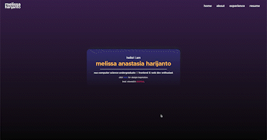

# melissa's portfolio website v2

For v1, view it in this <a href="https://github.com/melissaharijanto/website-v1">repository</a> for the source code. The site is deployed <a href="https://melissaharijanto.github.io/website-v1">here</a>.

## website preview

**Note: This site is best viewed in desktop!**

Some features of the site:
- The website displays (work) experience and activities!
- Projects are now separated into tabs. Main projects displayed are **tech projects**. Design projects can be viewed by toggling the hyperlink on top of the tab.
- Clicking on the tech projects will display a modal that displays more detailed information!

Things I experimented with (and liked): 
- All gradient color theme :grin: mainly using the colors I used in my GameRoom project, linked <a href="https://github.com/melissaharijanto/gameroom-frontend"> here</a>.
- Navbar background to blur on scroll :heartpulse:

To be implemented soon: 
- Mobile responsiveness :iphone:

## inspiration & acknowledgement

- Design is heavily inspired by <a href="https://open.spotify.com/">Spotify</a>.
- The font used is Metropolis, to be viewed <a href="https://fontsarena.com/metropolis-by-chris-simpson/#google_vignette">here</a>, as the original repository has been taken down.

## reuse

In **any** case of reuse, please keep the **Copyright** text in the footer as it is (other elements of the footer can be modified). Thanks! 